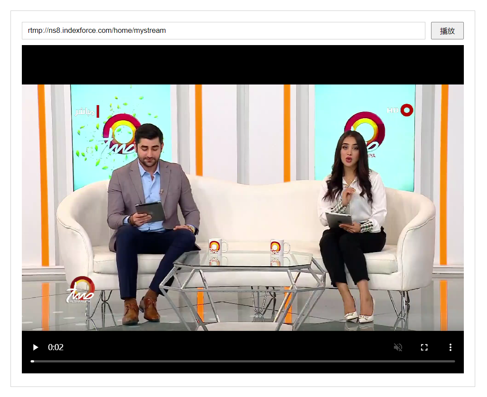

# streamToVideo

#### 介绍
rtsp/rtmp/m3u8视频流媒体播放解决方案，使用WebSocket服务和ffmpeg把rtsp/rtmp/m3u8视频流实时转为flv格式发送给前端，再使用flv.js播放

#### 软件架构
Vue2、[ffmpeg](https://www.ffmpeg.org/download.html)


#### 安装教程

npm install

#### 使用说明
  本方案为vue项目，可分为前端和服务端，这里主要重点说一下服务端，服务端使用的是WebSocket服务，根据ffmpeg工具实现实时转流，对实时流进行格式转换输出flv格式，前端使用flv.js插件播放flv格式的视频，如果没有安装[ffmpeg](https://www.ffmpeg.org/download.html)工具，请先安装！

tips：在根目录启动两个命令窗口分别运行启动

服务端启动
```
npm run start
```
前端启动
```
npm run serve
```

#### 预览图


